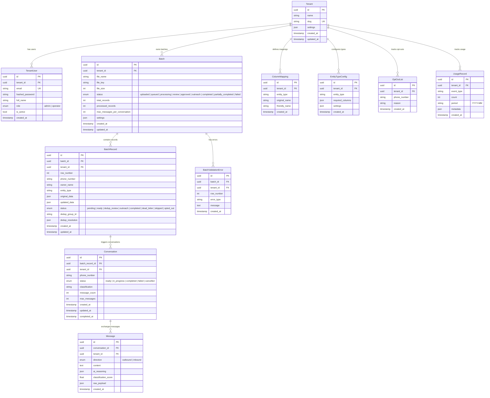

# Customers Data Updater

Multi-tenant SaaS platform for automated real estate data refresh via AI-powered WhatsApp conversations. Built for Brazilian real estate agencies.

**Flow:** Upload CSV/Excel → Async processing (dedup, column mapping, validation) → AI WhatsApp outreach to property owners → Download refreshed CSV

## Tech Stack

- **API:** Python 3.12, FastAPI, Pydantic v2
- **Database:** PostgreSQL (async SQLAlchemy 2.0), Alembic migrations
- **Queue:** Celery + Redis
- **Storage:** S3-compatible (AWS S3 / MinIO)
- **AI:** Claude API (conversation orchestration)
- **Messaging:** WhatsApp Business API

## Data Model



## Getting Started

### Prerequisites

- Python 3.12+
- Docker & Docker Compose (for PostgreSQL, Redis, MinIO)

### Setup

```bash
# Start infrastructure
docker-compose up -d

# Install dependencies
python -m venv .venv
source .venv/bin/activate
pip install -e ".[dev]"

# Run migrations
alembic upgrade head

# Start API
uvicorn app.main:app --reload

# Start Celery worker (separate terminal)
celery -A app.celery_app worker -l info
```

### Running Tests

```bash
pytest tests/ -v
```

## API Endpoints

| Endpoint | Method | Description |
|----------|--------|-------------|
| `/auth/login` | POST | JWT login |
| `/auth/register` | POST | Register user |
| `/auth/refresh` | POST | Refresh token |
| `/tenants/` | POST | Create tenant |
| `/batches/upload` | POST | Upload CSV/Excel |
| `/batches/{id}` | GET | Batch status |
| `/batches/{id}/errors` | GET | Validation errors |
| `/batches/{id}/dedup-groups` | GET | Dedup groups |
| `/batches/{id}/approve` | POST | Approve batch |
| `/batches/{id}/download` | GET | Download refreshed CSV |
| `/batches/{id}/dead-letter` | GET | Dead letter records |
| `/conversations/` | GET | List conversations |
| `/conversations/{id}` | GET | Conversation detail |
| `/webhooks/whatsapp` | POST | WhatsApp webhook |
| `/mappings/` | GET/PUT | Column mappings |
| `/erasure/phone/{phone}` | POST | LGPD data erasure |
| `/usage/` | GET | Usage summary |

## License

Proprietary
